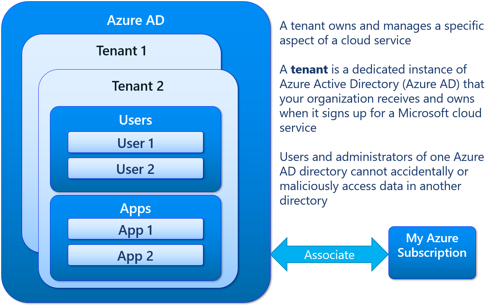
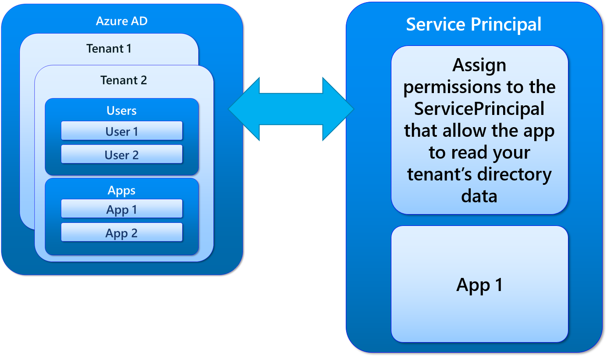
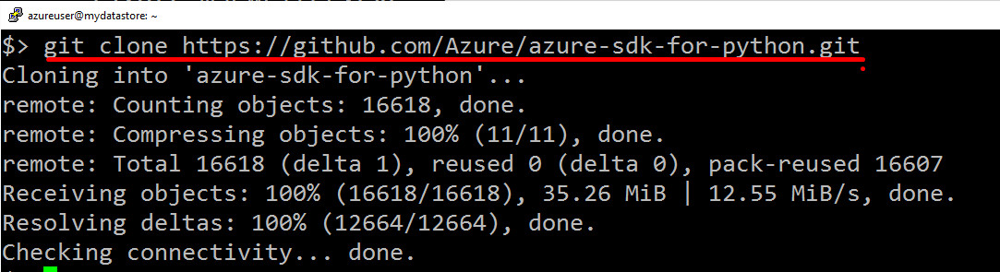
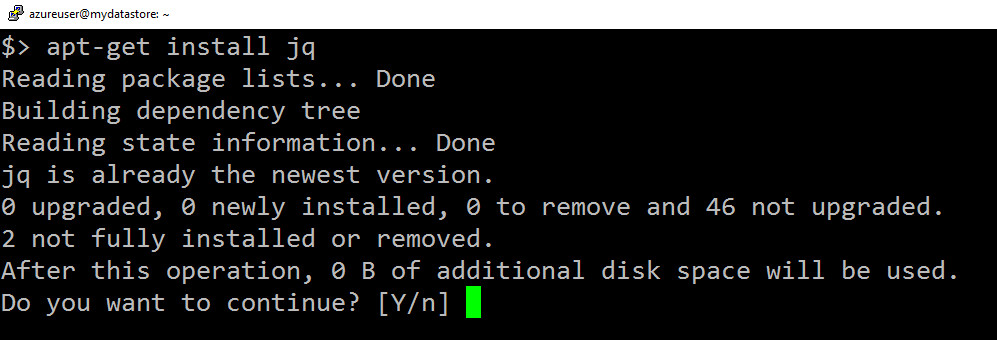
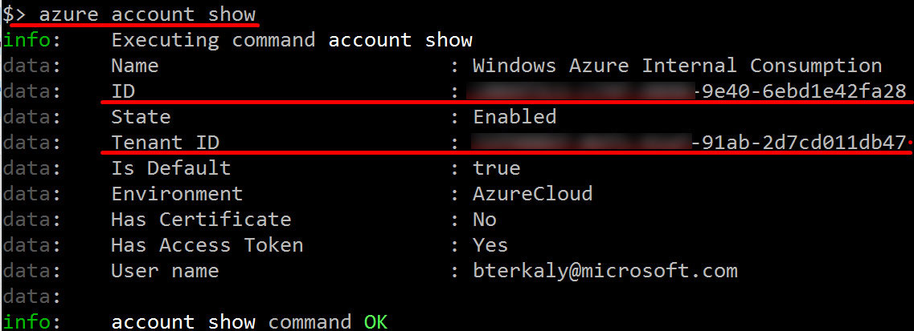
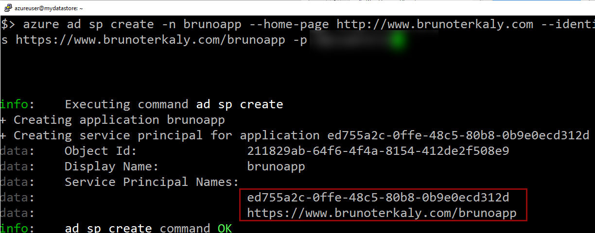

You will need to begin by setting things up to give your application and identity to run under. Two objects will need to be created:

- Active Directory application
	- Contains credential (app id + (pwd or cert))
	- Python works best with pwd
- Service Principal
	- Contains role assignment
	- Many can be created
	- Single SP needed for LOB apps in a business
	- Multiple SPs if need to run in many organizations

## The need for a tenant ID

There is some vocabulary that is important to understand before moving forward:
- Tenant ID
- Service Principal

> A **tenant** is a representative of an organization. A tenant is received by a business when it signs up for Azure. A tenant contains information about users in a company (passwords, profile data, permissions). Tenants also contains groups, applications.

> **ServicePrincipal object**: This object represents an instance of your app in your directory tenant. You can apply policies to ServicePrincipal objects, including assigning permissions to the ServicePrincipal that allow the app to read your tenant’s directory data. Whenever you change your Application object, the changes are also applied to the associated ServicePrincipal object in your tenant.

Some more facts about **service principals**
- Once you have a service principal, you will get its Object Id.
- The objectId is needed for granting permissions on your subscriptions.
- The objectId is needed for getting access to resources in subscriptions.
- Conceptually, Permissions leverage role-based access control.
- Once the service principal is setup, you can log in with the credential through Azure CLI.
- You can also use the service principal in conjunction with a certificate.


Notice that tenants are used to manage some or all of your cloud services. A tenant is an instance in Azure Active Directory. You will associate tenants with your subscription.



_Figure 1:  Understanding Tenants_

The service principal is the mechanism that connects your app to the tenants in Azure Active directory.




_Figure 2: Allowing your app to read tenant information through service principal_  

You will provide details about your organization and your organization’s Internet domain name registration

Azure SDK for Python
https://github.com/Azure/azure-sdk-for-python.



_Figure 3:  Installing Azure SDK for Python_

## Get tenant Id and subscription id

In this section:

- Installing jq
- Retrieving subscription id and tenant id

You will need to make sure that **jq** is installed.

> jq is a lightweight and flexible command-line JSON processor



_Figure 4:  Installing jq_

```bash
apt-get install jq
```

_Code Snippet 1: Installing jq_

#### Issuing "azure account show"

````bash
azure account show
````

_Code Snippet 2: Explain snippet_

Using the Azure command line tools to retrieve the **subscription ID** and the **tenant ID**



_Figure 5:  Retrieving the subscription ID and the tenant ID_

Now that we have a subscription ID and tenant ID, we can now turn our attention to creating a **service principal** for our **application.** In the code snippet below we actually programmatically retrieve the **tenant ID** again, even though we got up from the previous step.

```bash
azure config mode arm
# -----------------------------------------------
# azure login
# -----------------------------------------------
# Set subscription id
subscriptionId=abcdef-c74f-4898-9e40-6ebd1e42fa28
tenantId=$(azure account show -s $subscriptionId --json | jq -r '.[0].tenantId')

echo "tenantId="$tenantId
echo "subscriptionId="$subscriptionId
```

_Code Snippet 3: Retrieving tenantId_

#### Creating a service principal for our application

```bash
azure ad sp create -n brunoapp --home-page http://www.brunoterkaly.com --identifier-uris https://www.brunoterkaly.com/brunoapp -p P@ssw0rd!23
```

_Code Snippet 4: Creating service principal_

Notice the outcome of this command:
- Object Id
	- 211829ab-64f6-4f4a-8154-412de2f508e9 
- Service Principal Names

How to verify object id:

```bash
azure ad sp show --objectId 211829ab-64f6-4f4a-8154-412de2f508e9
```

More commands:

```bash
azure role assignment create --objectId 211829ab-64f6-4f4a-8154-412de2f508e9
```
Grant the service principal permissions on your subscription. 
- In this sample you will grant the service principal the permission to **Owner** of all resources in the subscription. 

```bash
azure role assignment create --objectId 211829ab-64f6-4f4a-8154-412de2f508e9 -o Owner -c /subscriptions/c884f3c1-c74f-4898-9e40-6ebd1e42fa28/
```




_Figure 6:  Creating a service principal for your application_


#### Assign roles to service principal

By now you have created a display name for your application and have provided a URI for a page that describes your application. Be aware that the link to the description is not verified.


#### 3 things needed before writing Python code:

- Application ID
- Application secret
- Tenant ID

```bash
apt-get update
apt-get -y install python-pip


pip install azure
pip install azure-storage
pip install azure-servicebus
pip install azure-mgmt

git clone git://github.com/Azure/azure-sdk-for-python.git
cd azure-sdk-for-python
python setup.py install

git clone https://github.com/AzureAD/azure-activedirectory-library-for-python.git
cd azure-activedirectory-library-for-python
python setup.py install


pip install adal
```

_Code Snippet 5: Installing Azure Python Library_

```python
import adal
token_response = adal.acquire_token_with_client_credentials(
    'https://login.microsoftonline.com/' + '<tenantId>',
    '<ApplicationId>',
    '<Application Secret>'
)
access_token = token_response.get('accessToken')
print(access_token)
```

_Code Snippet 6: Retrieving Access Token_

```python
import adal
import requests
token_response = adal.acquire_token_with_client_credentials(
    'https://login.microsoftonline.com/' + '<tenantId>',
    '<ApplicationId>',
    '<Application Secret>'
)
access_token = token_response.get('accessToken')

endpoint = 'https://management.azure.com/subscriptions/?api-version=2015-01-01'

headers = {"Authorization": 'Bearer ' + access_token}
json_output = requests.get(endpoint,headers=headers).json()
for sub in json_output["value"]:
    print(sub["displayName"] + ': ' + sub["subscriptionId"])
```

_Code Snippet 7: Explain snippet_

```
```

_Code Snippet 8: Explain snippet_

```
```

_Code Snippet 9: Explain snippet_


