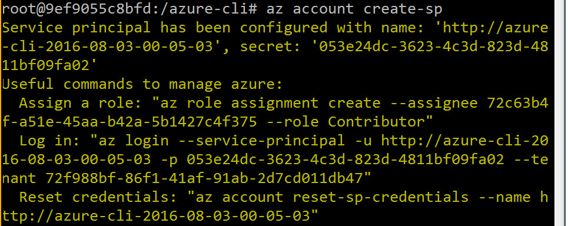
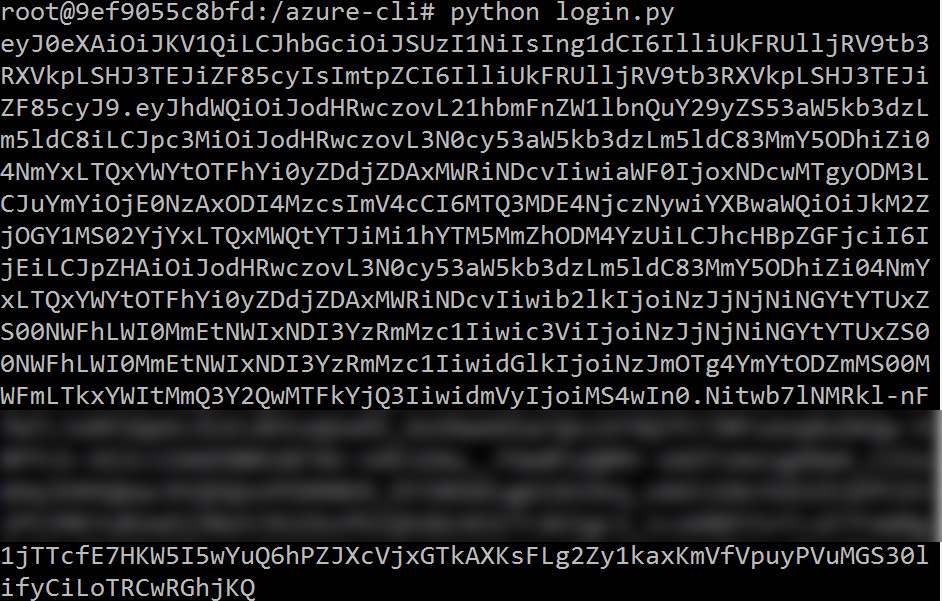

# Authenticating with Python

The goal of this post is to illustrate how to use python to manage and support Azure infrastructure. Whether you wish to deploy an SSH Enabled VM or manage Azure Resources and Resource Groups, this post will provide samples and guidance.

There are a few steps to managing infrastructure in Azure using Python applications.
The first step is to create an identity for the python application that includes authentication credentials and role assignments. Once the application has been authenticated, it can begin to manage or create resources in a subscription.

There are a few technologies that are needed. The idea is that you have an application already defined, complete with a URI that describes your application. You will create a tenant in Azure Active directory. Next, you will 

You will then begin working with an Active Directory (AD) application and begin to assign the required permissions to it.

https://azure.microsoft.com/en-us/documentation/articles/resource-group-authenticate-service-principal-cli/
https://azure.microsoft.com/documentation/samples/resource-manager-python-template-deployment/
https://msftstack.wordpress.com/2016/01/05/azure-resource-manager-authentication-with-python/

## Getting started

```bash
run docker pull azuresdk/azure-cli-python:latest
run docker run -it azuresdk/azure-cli-python:latest /bin/bash
```

_Code Snippet 1: Run Azure CLI in Docker container_



_Figure 1:  Creating the Service Principal_

```bash
az account create-sp
```

_Code Snippet 2: Create SP_

Output:

```
Service principal has been configured with name: 
  'http://azure-cli-2016-08-03-00-05-03', 
   secret: '053e24dc-3623-4c3d-823d-4811bf09fa02'

Useful commands to manage azure:
  Assign a role: 
     "az role assignment create --assignee 
	     72c63b4f-a51e-45aa-b42a-5b1427c4f375 --role Contributor"
  Log in: 
      "az login --service-principal 
	     -u http://azure-cli-2016-08-03-00-05-03 
		 -p 053e24dc-3623-4c3d-823d-4811bf09fa02 
		 --tenant 72f988bf-86f1-41af-91ab-2d7cd011db47"

  Reset credentials: 
       "az account reset-sp-credentials 
	       --name http://azure-cli-2016-08-03-00-05-03"
```

_Code Snippet 3: Output for creating SP_

Installing an editor:

```bash
apt-get update
apt-get install vim
```

_Code Snippet 4: Install VIM_

Writing the authorization code

```python
import adal

authentication_endpoint = 'https://login.microsoftonline.com/'
resource  = 'https://management.core.windows.net/'

tenant_id =  "blah-86f1-41af-91ab-2d7cd011db47"
app_id =  "http://azure-cli-2016-08-03-00-05-03"
app_secret =  "secret"

# get_access_token(tenant_id, application_id, application_secret)
# get an Azure access token using the adal library
def get_access_token(tenant_id, application_id, application_secret):
    context = adal.AuthenticationContext(authentication_endpoint + tenant_id)
    token_response = context.acquire_token_with_client_credentials(resource, application_id,

     application_secret)
    return token_response.get('accessToken')

auth_token = get_access_token(tenant_id, app_id, app_secret)
print (auth_token)
```

_Code Snippet 5: Python Auth Code_

Running the authorization code:



_Figure 2:  Running Python code to create Auth token_
