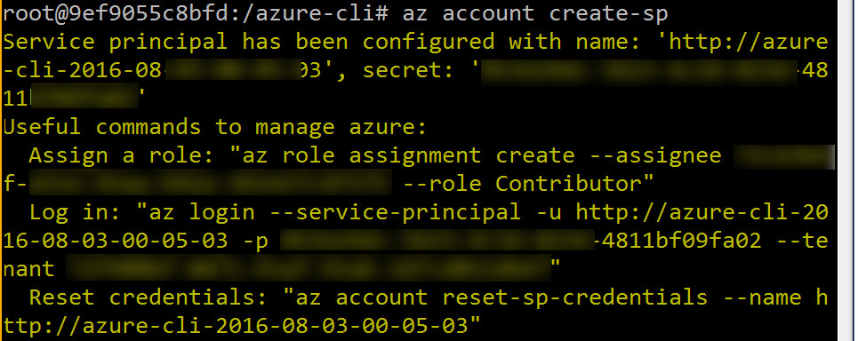
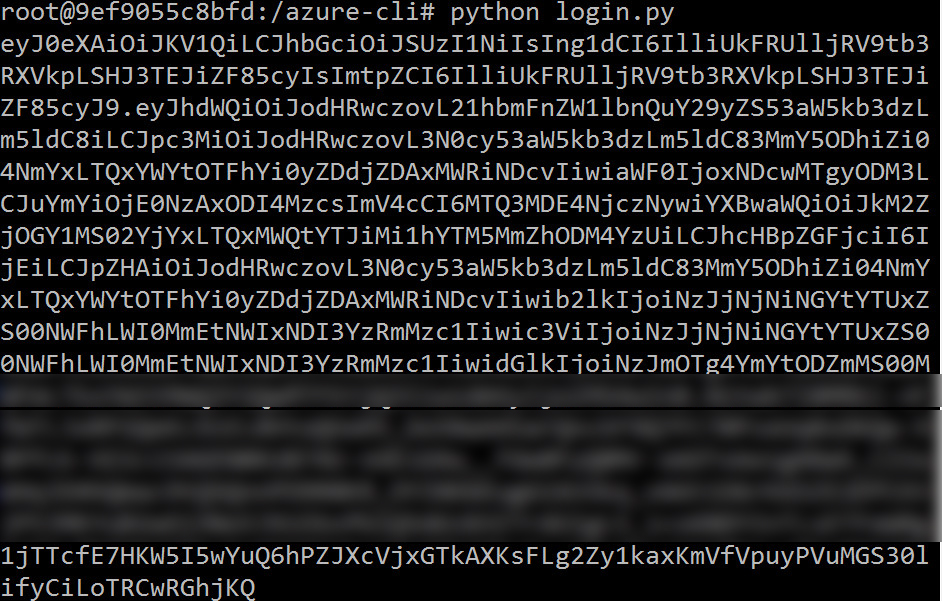

# Authenticating with Python

The goal of this post is to illustrate how to use python to manage and support Azure infrastructure. Whether you wish to deploy an SSH Enabled VM or manage Azure Resources and Resource Groups, this post will provide samples and guidance.

There are a few steps to managing infrastructure in Azure using Python applications.

#### Defining an identity

The first step is to create an identity for the python application that includes authentication credentials and role assignments. Once the application has been authenticated, it can begin to manage or create resources in a subscription.


#### Running an Azure CLI container

Let's begin by running a Docker container that includes the Azure SDK, with both the Azure client tools as well as the Azure Python tooling. The commands below allow you to quickly run in an environment that is containerized without having to install any tooling.

```bash
run docker pull azuresdk/azure-cli-python:latest
run docker run -it azuresdk/azure-cli-python:latest /bin/bash
```


#### Creating a Service Principal

_Code Snippet 1: Run Azure CLI in Docker container_

This next command provides some important functionality.
- It creates a service principal (defined below)
- It provides information that you will need in your Python app when you authenticate. You will need this information to authenticate your app so that it can provision and manage infrastructure in Azure.
	- Tenant Id
	- App Id
	- App Secret
- It provides outputs commands to assign role permissions (reader or contributor, etc)


> A **tenant** is a representative of an organization. A tenant is received by a business when it signs up for Azure. A tenant contains information about users in a company (passwords, profile data, permissions). Tenants also contains groups, applications.

> **ServicePrincipal object**: This object represents an instance of your app in your directory tenant. You can apply policies to ServicePrincipal objects, including assigning permissions to the ServicePrincipal that allow the app to read your tenant’s directory data. Whenever you change your Application object, the changes are also applied to the associated ServicePrincipal object in your tenant.


```bash
az account create-sp
```


_Code Snippet 2: Create SP_


Here is what the output of the command looks like.



_Figure 1:  Creating the Service Principal_

Output for **az account create-sp.**

#### Additional commands that are available

Notice there are additional commands that have been provided:

- Role Assignment
- Login code
- Resetting of credentials

```
Service principal has been configured with name: 
  'http://azure-cli-2016-07-03-00-05-03', 
   secret: 'blah-blah-3623-4c3d-823d-4811bf09fa02'

Useful commands to manage azure:
  Assign a role: 
     "az role assignment create --assignee 
	     blah-a51e-45aa-b42a-5b1427c4f375 --role Contributor"
  Log in: 
      "az login --service-principal 
	     -u http://azure-cli-2016-08-03-00-05-03 
		 -p blah-3623-4c3d-823d-4811bf09fa02 
		 --tenant blah-86f1-41af-91ab-2d7cd011db47"

  Reset credentials: 
       "az account reset-sp-credentials 
	       --name http://azure-cli-2016-08-03-00-05-03"
```

_Code Snippet 3: Output for creating SP_

The docker container does not have the VIM editor built in. Since that is my editor of choice, I will install it, as seen in Code Snippet 4.

```bash
apt-get update
apt-get install vim
```

_Code Snippet 4: Install VIM_

At this point we are ready for the main event - to authenticate inside of a Python app and display an authorization token.

```python
import adal

authentication_endpoint = 'https://login.microsoftonline.com/'
resource  = 'https://management.core.windows.net/'

tenant_id =  "blah-86f1-41af-91ab-2d7cd011db47"
app_id =  "http://azure-cli-2016-08-03-00-05-03"
app_secret =  "secret"

# get_access_token(tenant_id, application_id, application_secret)
# get an Azure access token using the adal library
def get_access_token(tenant_id, application_id, application_secret):
    context = adal.AuthenticationContext(authentication_endpoint + tenant_id)
    token_response = context.acquire_token_with_client_credentials(resource, application_id,

     application_secret)
    return token_response.get('accessToken')

auth_token = get_access_token(tenant_id, app_id, app_secret)
print (auth_token)
```

_Code Snippet 5: Python Auth Code_

Running the authorization code:



_Figure 2:  Running Python code to create Auth token_


## How to do it with the Azure Python SDK

Here’s an example that shows how to authenticate with the Azure Python SDK.

```python
from azure.common.credentials import ServicePrincipalCredentials
from azure.mgmt.resource.resources import ResourceManagementClient
from azure.mgmt.resource.resources.models import ResourceGroup
import json

subscription_id = "mysubid"

credentials = ServicePrincipalCredentials(
    client_id = ‘myclientid,
    secret = 'mysecret',
    tenant = 'mytenantid'
)
resource_client = ResourceManagementClient(
    credentials,
    subscription_id
)
```


_Code Snippet 6: Official Python SDK_